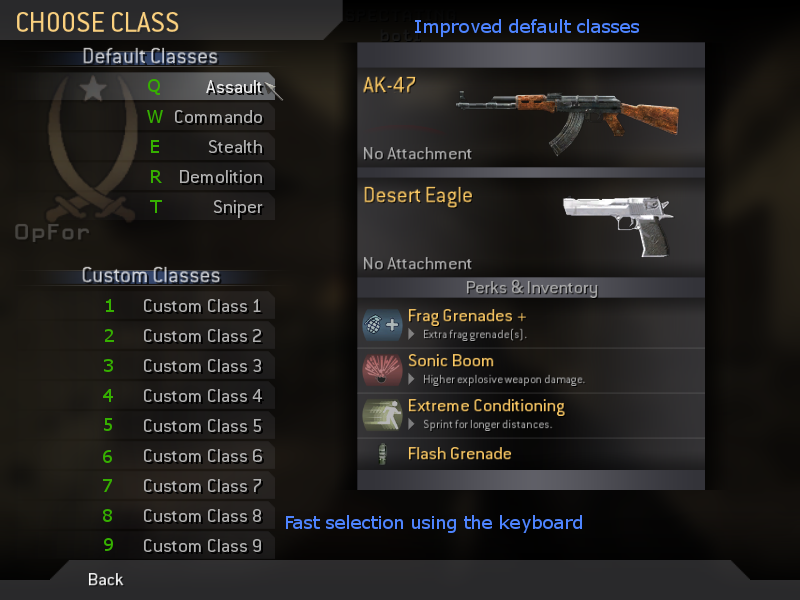

# Leetmod

A Call of Duty 4 mod by nostalgicamigo based on
[OpenWarfare (archived)](http://web.archive.org/web/20111128184124/http://openwarfaremod.com/owforum/viewtopic.php?f=59&t=3076).

This is a fork of [nostalgicamigo's original repository](http://sourceforge.net/projects/leetmod/) for archiving purposes.

## Description

Leetmod brings many new features and fixes upon CoD4 v1.7.
Everything that was wrong, unbalanced or missing was improved.
Also brings bots to the game (powered by PeZBOT).

It was born from the necessity of balancing the game and players and at the same time be an autonomous and dynamic tool
that controls the rotation, gameplay and more.

We like to think in Leetmod as a Call of Duty 4 v1.8 (which was never released), seeing that, everything that was wrong,
unbalanced or missing, was improved, just like a patch.

See also the [changelog](./CHANGELOG.md).

## Features

- 50 configuration files with more than 750 configurable variables
- Better hit detection
- Dynamic rotation and following gameplay rules
- Anti-camping (passive)
- Spawn protection
- Fixed Bugs in weapons and gameplay
- Extended Player Statistics
- Server Players Statistics Viewer
- Final Statistics
- Final Killcam
- New Killcams
- New Game Types
- New Maps directly accessible from the menu
- Bots (powered by PeZBOT)
- Create classes during the game and increased slots to 9!
- Editable Default classes
- Third Person feature
- Selection of soldier type
- Keyboard menu selection
- Admin Control Panel (in-game control of maps, players, rules)
- AFK to spectator, AFK-Spectactor kick
- 65 Rank levels with Prestige
- Notification sounds
- Binoculars and snipers with range finder and zoom
- Day/Night dynamic cycle system for all maps
- More Health Systems, with medic roles, bleeding, injuries and bandages
- New graphical options for better performance, visual options (HUD) and controls
- ... and many more

### In-Game Menu: Create-a-Class

Creating, saving and using a class is even faster than before, thanks to the quick selections and keyboard support.
Also, you don't have to wait to unlock anything, you can manually unlock each item you need if you want.

### In-Game Menu: Other players rank

Now you can view in-game the other players' profiles and their rank and compare them to yours.

### In-Game Menu: End-of-Game Statistics

At the end of game, many statistics are presented with the best players on that category too.
Finally, you can see who was the biggest camper.

### In-Game Menu: Admin Control Panel

Now you can control maps, rotation, rules, and players on your server in-game.
Very useful for server admins and also in LAN Parties because you can quickly switch anything.

### In-Game Menu: Class selector

There are more slots for your classes (now 9!),
the default classes were improved and there is support for selecting with the keyboard on all menus.

### Server Configurations

Improved configuration interface and many new menus to set the game the way you and your friends want to play it.
All these menus are available in-game too! Also, bots are supported in almost every map.

---

Read more at [Leetmod website (archived)](https://web.archive.org/web/20150508001731/http://leetmod.pt.am/)
or [Mod DB](https://www.moddb.com/mods/leetmod).
